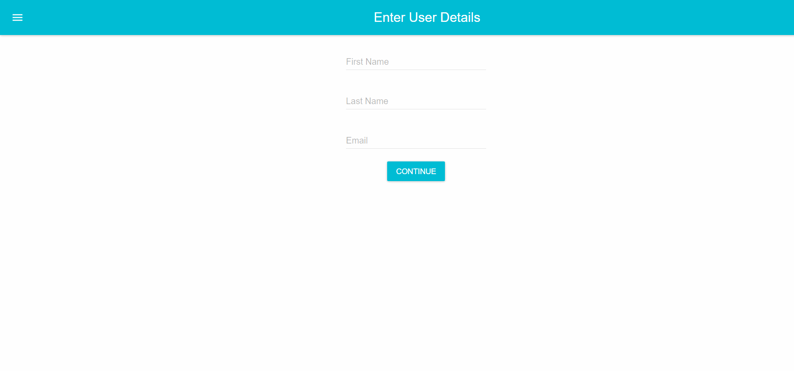

<h1 align="center">Form React Material UI</h1>

 
   

<h2>📖 Sobre</h2>

 MERN STACK

 Form developed with React and Material UI.

------------

<h2>🚀 Tecnologias</h2>

Este projeto foi desenvolvido com as seguintes tecnologias:
- [NodeJs](https://nodejs.org/en/)
- [Express](https://expressjs.com/)
- [React](https://reactjs.org/)
- [Material UI](https://material-ui.com/)

------------

<h2>🎓 Quem ministrou?</h2>
[Por fazer]

------------

<h2>📃Licença</h2>

Este projeto está sobre a Licença do MIT. Acesse a <a href="https://github.com/Nandosbx/form-react-materialui/blob/master/LICENSE.md">Licença</a> e saiba mais.

------------

<footer align="center">
 <strong align="center">Made with 💜 by Fernando Batista</strong>
</footer>